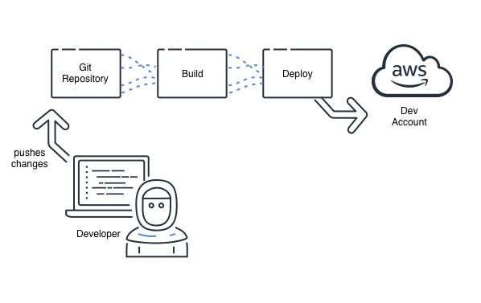

# sam-rust-template

### CI/CD with GitHub

CI/CD stands for Continuous Integration and Continuous Deployment (or Continuous Delivery). It's a set of practices and tools designed to improve the software development process by automating builds, testing, and deployment, enabling you to ship code changes faster and reliably.

* `Continuous integration (CI)`: Automatically builds, tests, and integrates code changes within a shared repository.

* `Continuous delivery (CD)`: automatically delivers code changes to production-ready environments for approval.

* `Continuous deployment (CD)`: automatically deploys code changes to customers directly.
  

### AWS SAM Pipelines
A deployment pipeline is an automated sequence of steps that are performed to release a new version of an application. They are defined by a pipeline template file. AWS SAM Pipelines provides templates for popular CI/CD systems such as AWS CodePipeline, Jenkins, GitHub Actions, and GitLab CI/CD. Pipeline templates include AWS deployment best practices to help with multi-account and multi-Region deployments. AWS environments such as dev and production typically exist in different AWS accounts. This allows development teams to configure safe deployment pipelines, without making unintended changes to infrastructure. You can also supply your own custom pipeline templates to help to standardize pipelines across development teams. [[1]](#notes)

### Notes

* [1] - [[Blog] Introducing AWS SAM Pipelines: Automatically generate deployment pipelines for serverless applications](https://aws.amazon.com/blogs/compute/introducing-aws-sam-pipelines-automatically-generate-deployment-pipelines-for-serverless-applications/)